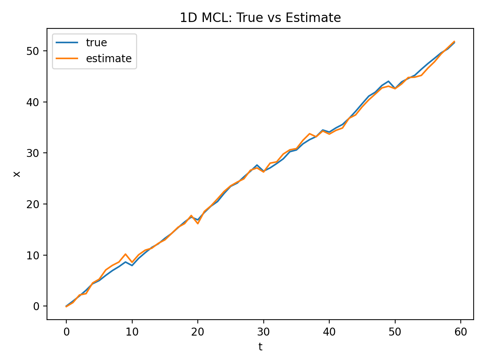
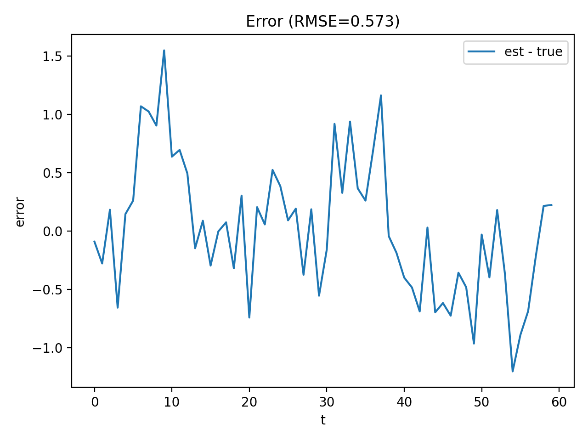

# 1D MCL (Particle Filter)
確率ロボティクス課題として、**1次元ロボット**の自己位置推定を **MCL** で実装しました。

## 目的
移動、観測にノイズがある状況で、観測（z）と行動（u）からロボット位置を推定します。

## 補足
- 本実装は **1次元** の簡易設定です
- 出力画像は `src/outputs/` に保存されます

## 実装内容（MCLの流れ）
本実装では以下の手順で自己位置推定を行います。  
1. **予測**：運動モデルで粒子を移動  
2. **計測更新**：観測尤度により粒子の重みを更新  
3. **リサンプリング**：Neffが小さいときにsystematic resamplingを実行

## モデル
- 運動モデル：`x_t = x_{t-1} + u_t + N(0, σ_move^2)`
- 観測モデル：`z_t = |L - x_t| + N(0, σ_obs^2)`

## ファイル構成
- `src/sim.py`：真値と観測の生成
- `src/models.py`：観測尤度（計測モデル）
- `src/mcl.py`：MCL本体（Neff + resampling）
- `src/plot.py`：結果の図を保存

## 参考
- 上田先生『詳解 確率ロボティクス』の第8章、MCL（予測→計測更新→リサンプリング）の流れを参考にしました。
- 上田 隆一『詳解 確率ロボティクス Pythonによる基礎アルゴリズムの実装（KS理工学専門書）』  
  https://www.amazon.co.jp/dp/4065170060

## インストール方法
```bash
git clone https://github.com/Yoshino0304/prob-robotics-mcl.git
cd prob-robotics-mcl
pip3 install -r requirements.txt
```

## MCL実行
```bash
cd prob-robotics-mcl/src
python3 mcl.py
```
## 結果
### 結果の図を生成
```bash
python3 plot.py 
```
### 真値と推定（trajectory）
横軸が時刻 t 、縦軸が1次元位置 x です。  
**true** がシミュレーション上の真値、**estimate** がMCLによる推定値を表します。



### 推定誤差（error）
推定誤差 **error = estimate - true** の時間変化です。  
0に近いほど推定が正確で、タイトルにRMSE（誤差の平均的な大きさ）を表示します。



## 必要なソフトウェア
- Python 3.8 以上（動作確認：Python 3.8.10）

## 動作確認済み環境
- Ubuntu 20.04

## ライセンス
- このソフトウェアパッケージは、3条項BSDライセンスの下、再頒布および使用が許可されます。
- © 2026 Taiki Yoshino

